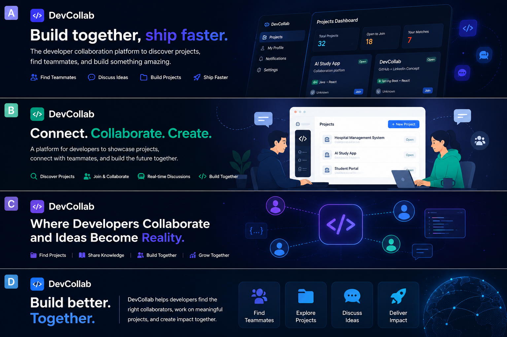
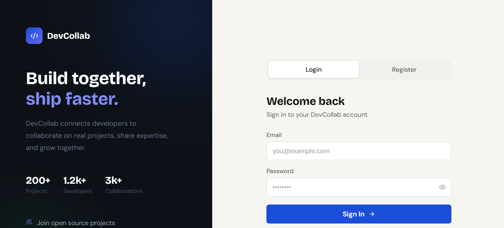
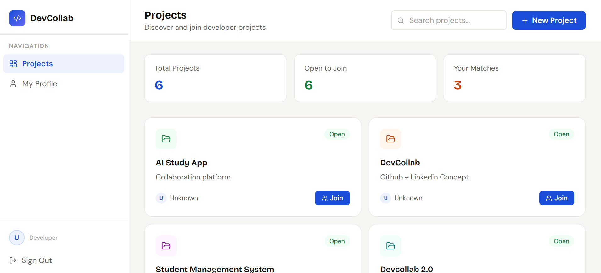
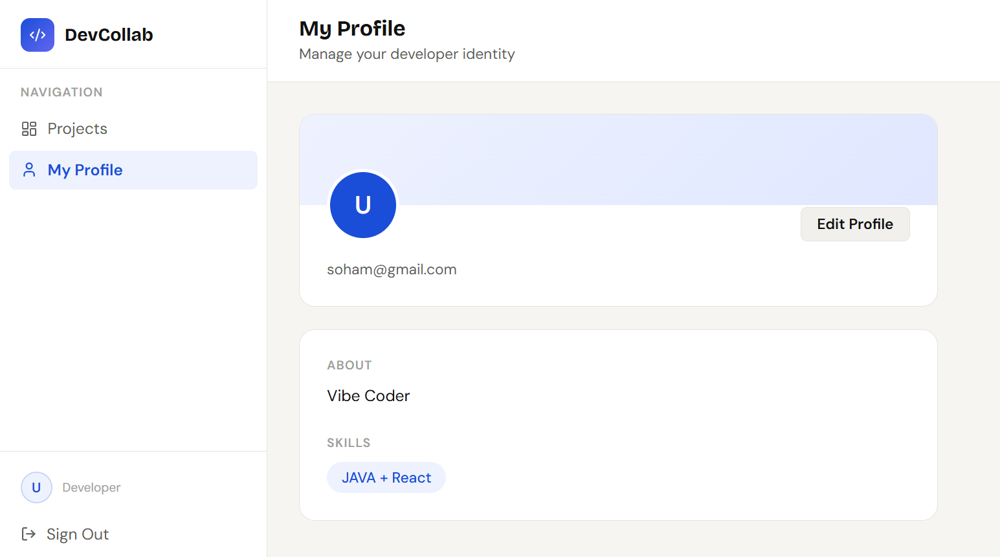
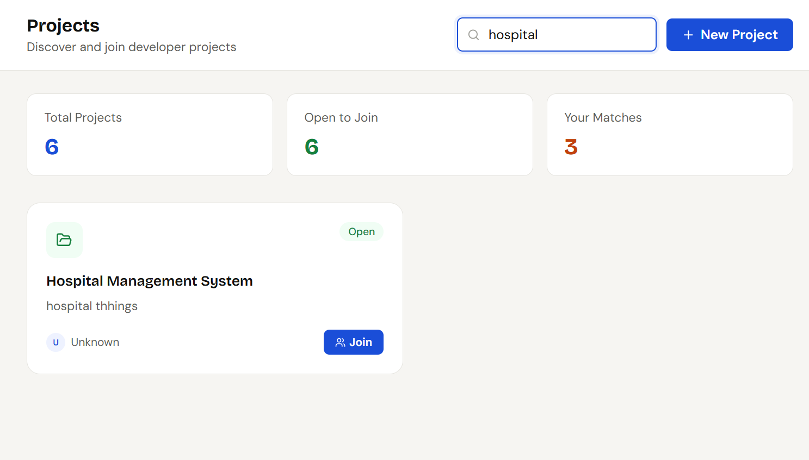
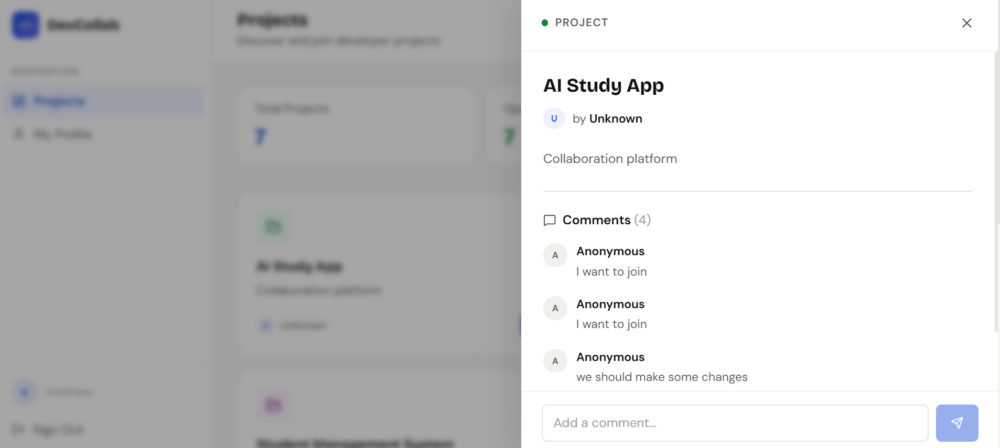

<p align="center">
  
</p>

<div align="center">

# 🚀 DevCollab

### Build together, ship faster.

A full-stack developer collaboration platform where developers can showcase projects, discover teammates, and collaborate in real time.

---


</div>

---

# 🌟 About The Project

DevCollab is a developer collaboration platform designed to help developers connect, build, and grow together.

Developers can showcase their projects, search for collaborators, join teams, and discuss ideas through a real-time discussion system.

The inspiration behind DevCollab came from a real problem:

> While building projects, I often had backend development knowledge but needed frontend developers to collaborate with. Finding the right teammates was difficult.

DevCollab solves this by creating a space where developers can discover projects and collaborate based on skills and interests.

---

# ✨ Features

* 🚀 Create and showcase projects
* 🤝 Join developer projects
* 💬 Real-time discussion/comment section
* 👤 Developer profile management
* 🔍 Search projects easily
* 🔐 JWT Authentication & Authorization
* 🏗 Modular full-stack architecture
* 📱 Responsive UI design

---

# 📸 Screenshots

## 🔐 Authentication



---

## 🏠 Projects Dashboard



---

## 👤 Developer Profile



---

## ➕ Create New Project



---

## 💬 Real-time Discussion System



---

# 🛠 Tech Stack

## Frontend

* React
* Vite
* Tailwind CSS
* Axios

## Backend

* Spring Boot
* Spring Security
* REST APIs
* Maven

## Database

* PostgreSQL

## Authentication

* JWT Authentication

## Tools

* Postman
* Git
* GitHub

---

# 🏗 Project Architecture

DevCollab follows a modular full-stack architecture:

```txt id="rprjvq"
Frontend (React + Tailwind)
        ↓
REST API Communication
        ↓
Backend (Spring Boot)
        ↓
PostgreSQL Database
```

---

# 📂 Project Structure

```bash id="ejcwb7"
devcollab/
│
├── devcollab/                  # Spring Boot Backend
│   ├── src/main/java/com.abhishek.devcollab
│   │   ├── activity
│   │   ├── auth
│   │   ├── comment
│   │   ├── common
│   │   ├── config
│   │   ├── dto
│   │   ├── exception
│   │   ├── project
│   │   ├── pullrequest
│   │   ├── repositorymodule
│   │   └── user
│
├── frontend/                   # React Frontend
│   ├── public
│   ├── src
│   │   ├── api
│   │   ├── components
│   │   ├── modals
│   │   ├── pages
│   │   ├── styles
│   │   ├── App.jsx
│   │   └── main.jsx
│
├── postman/                    # API Collections
│
└── README.md
```

---

# ⚙️ Installation & Setup

## 1️⃣ Clone Repository

```bash id="2fgf1c"
git clone https://github.com/abhishekmanegit/devcollab.git
cd devcollab
```

---

## 2️⃣ Backend Setup

```bash id="3x1a7e"
cd devcollab
mvn spring-boot:run
```

---

## 3️⃣ Frontend Setup

```bash id="m60t0z"
cd frontend
npm install
npm run dev
```

---

# 🚀 Future Improvements

* 🔗 GitHub integration
* 📄 Pagination support
* 🎯 Advanced filtering
* 🌐 Social developer connections
* 🧑‍💻 Dedicated team workspaces
* 🔔 Better collaboration tools

---

# 🤝 Contributing

Contributions are welcome!

1. Fork the repository
2. Create a feature branch
3. Commit your changes
4. Push to your branch
5. Open a Pull Request

---

# 👨‍💻 Author

### Abhishek

GitHub:
https://github.com/abhishekmanegit

Project Repository:
https://github.com/abhishekmanegit/devcollab

---

# 📄 License

This project is licensed under the MIT License.
