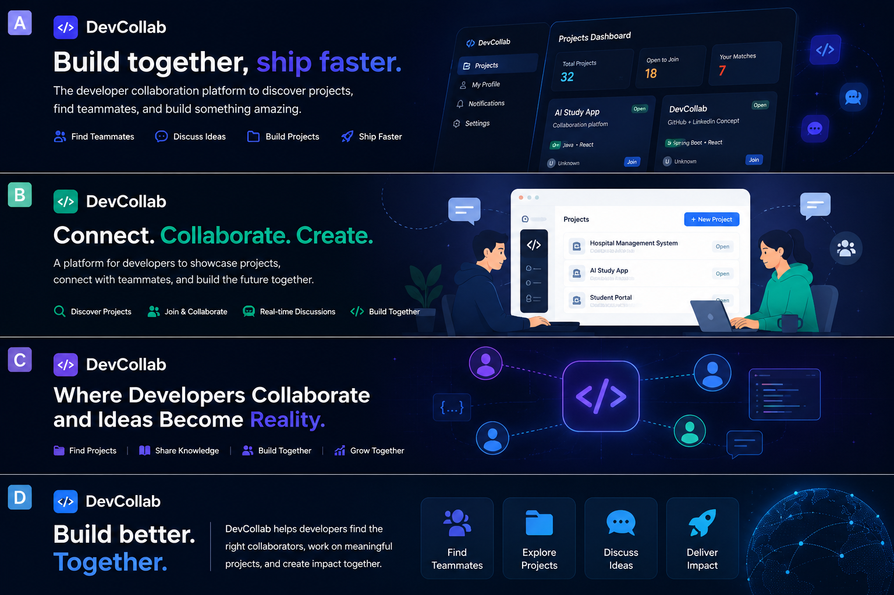
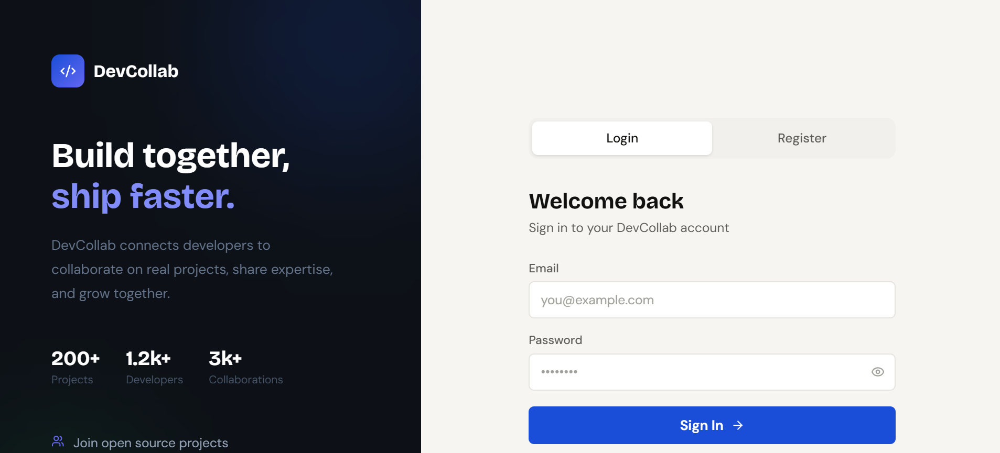
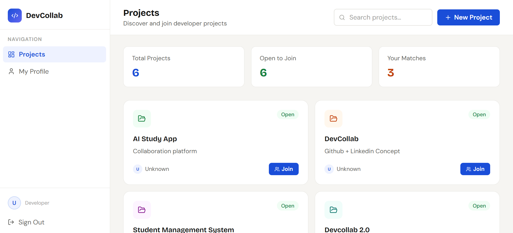
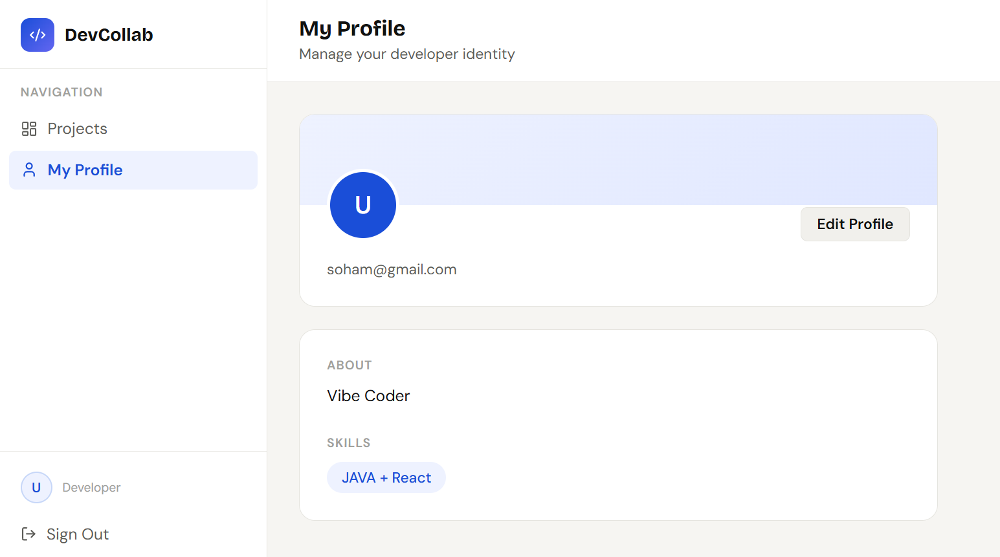
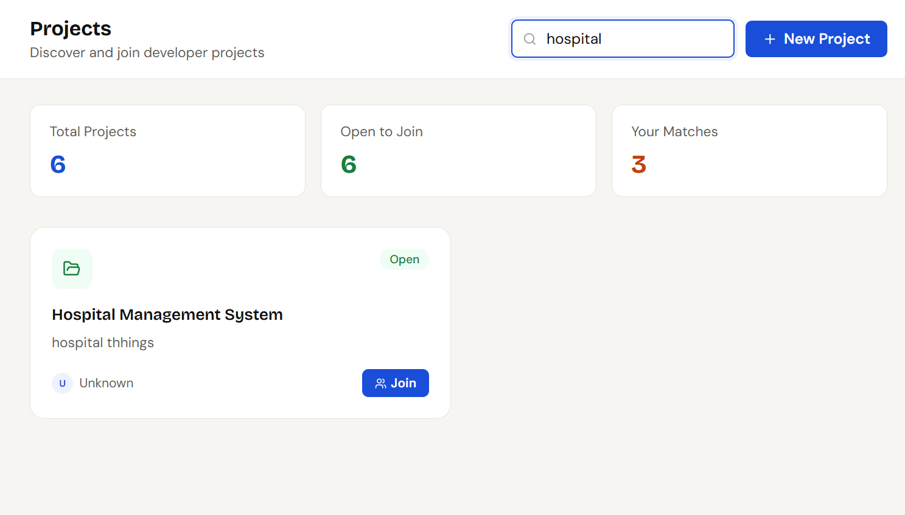
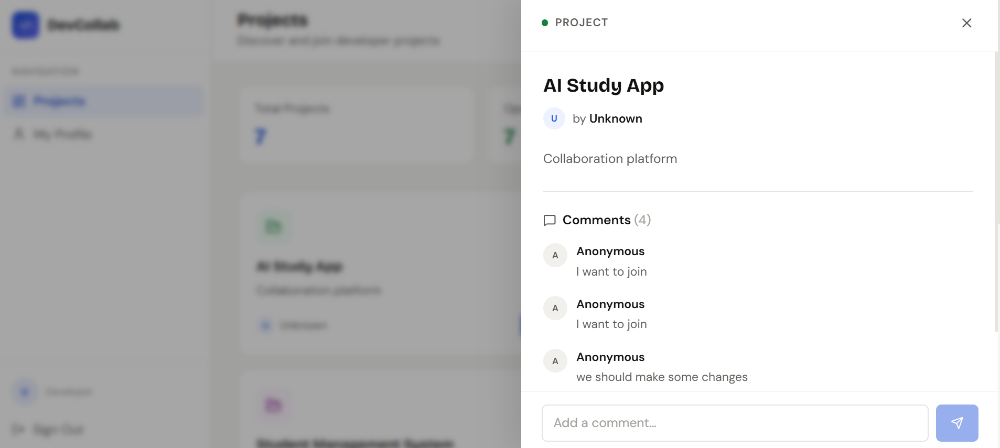

<p align="center">
  
</p>

<div align="center">

# 🚀 DevCollab

### Build together, ship faster.

A full-stack developer collaboration platform where developers can showcase projects, discover teammates, and collaborate in real time.

---


</div>

---

# 🌟 About The Project

DevCollab is a developer collaboration platform designed to help developers connect, build, and grow together.

Developers can showcase their projects, search for collaborators, join teams, and discuss ideas through a per-project comment thread.

The inspiration behind DevCollab came from a real problem:

> While building projects, I often had backend development knowledge but needed frontend developers to collaborate with. Finding the right teammates was difficult.

DevCollab solves this by creating a space where developers can discover projects and collaborate based on skills and interests.

---

# ✨ Features

* 🚀 Create and showcase projects with the skills they need
* 🤝 Join developer projects and see the team
* 💬 Per-project discussion threads
* 👤 Developer profile with bio, skills and GitHub profile
* 🖼 Avatar upload (JPEG, PNG, WebP, GIF up to 3MB)
* 🔍 Instant client-side search and "My Projects" filter
* 🔐 JWT authentication with stateless sessions and 1-hour tokens
* 🏗 Modular full-stack architecture
* 📱 Responsive UI design

---

# 📸 Screenshots

## 🔐 Authentication



---

## 🏠 Projects Dashboard



---

## 👤 Developer Profile



---

## ➕ Create New Project



---

## 💬 Discussion System



---

# 🛠 Tech Stack

## Frontend

* React 19
* Vite
* Lucide (icons)
* Plain CSS with custom-property design tokens
* Fetch API

## Backend

* Spring Boot
* Spring Security
* Spring Data JPA / Hibernate
* Bean Validation
* REST APIs
* Maven

## Database

* PostgreSQL

## Authentication

* JWT (jjwt, HS256)

## Tools

* Postman
* Docker
* Git
* GitHub

---

# 🏗 Project Architecture

DevCollab follows a modular full-stack architecture:

```txt
Frontend (React + Vite)
        ↓
REST API Communication
        ↓
Backend (Spring Boot)
        ↓
PostgreSQL Database
```

---

# 📂 Project Structure

```txt
devcollab/
│
├── devcollab/                       # Spring Boot backend
│   └── src/main/java/com/abhishek/devcollab
│       ├── DevcollabApplication.java
│       ├── auth/                    # login & registration
│       ├── comment/                 # discussion threads
│       ├── config/                  # security, JWT, CORS, static uploads
│       ├── dto/                     # request/response payloads
│       ├── exception/               # ApiException + global error handling
│       ├── project/                 # projects and memberships
│       └── user/                    # profiles and avatars
│
├── frontend/                        # React frontend
│   ├── public
│   └── src
│       ├── api                      # fetch wrapper and helpers
│       ├── components               # Sidebar, ProjectCard, Avatar, Toast
│       ├── modals                   # CreateProjectModal, ProjectDetailPanel
│       ├── pages                    # AuthPage, Dashboard, ProfilePage
│       └── styles                   # global.css (design tokens)
│
├── postman/                         # API collection globals
│
├── screenshots/
│
└── README.md
```

---

# 🔌 API Reference

All endpoints except auth require `Authorization: Bearer <token>`.

| Method | Endpoint | Description |
| ------ | -------- | ----------- |
| `POST` | `/api/auth/register` | Create an account |
| `POST` | `/api/auth/login` | Returns a JWT as a plain string |
| `GET` | `/api/users/me` | Current user profile |
| `PUT` | `/api/users/update` | Update bio, skills, GitHub URL |
| `POST` | `/api/users/me/avatar` | Upload a profile picture (multipart) |
| `GET` | `/api/users` | List users |
| `POST` | `/api/projects` | Create a project |
| `GET` | `/api/projects` | List all projects with join/owner state |
| `GET` | `/api/projects/my-projects` | Projects you created or joined |
| `POST` | `/api/projects/{id}/join` | Join a project |
| `GET` | `/api/projects/{id}/members` | Project team |
| `GET` | `/api/projects/{id}/comments` | Discussion thread |
| `POST` | `/api/projects/{id}/comments` | Add a comment |

Errors are returned as JSON: `{ "status": 400, "message": "...", "fieldErrors": { ... } }`.

---

# ⚙️ Installation & Setup

## 1️⃣ Clone Repository

```bash
git clone https://github.com/abhishekmanegit/devcollab.git
cd devcollab
```

---

## 2️⃣ Database

Create a PostgreSQL database named `devcollab`. Tables are generated by Hibernate on first run
(`spring.jpa.hibernate.ddl-auto=update`).

```bash
createdb devcollab
```

---

## 3️⃣ Backend Setup

```bash
cd devcollab
mvn spring-boot:run
```

Configuration lives in `src/main/resources/application.properties` and every value can be
overridden with an environment variable:

| Variable | Default | Purpose |
| -------- | ------- | ------- |
| `DB_URL` | `jdbc:postgresql://localhost:5432/devcollab` | JDBC connection string |
| `DB_USERNAME` | `postgres` | Database user |
| `DB_PASSWORD` | `postgre123` | Database password |
| `JWT_SECRET` | local dev value | HS256 signing key, **min 32 bytes** |
| `JWT_EXPIRATION_MS` | `3600000` | Token lifetime (1 hour) |
| `CORS_ALLOWED_ORIGINS` | localhost + Vercel origin | Comma-separated allowlist |
| `UPLOAD_DIR` | `uploads` | Where avatars are stored |
| `JPA_SHOW_SQL` | `false` | Log generated SQL |

> Set a real `JWT_SECRET` in production, e.g. `export JWT_SECRET=$(openssl rand -base64 48)`.
> The app refuses to start if the secret is shorter than 32 bytes.

---

## 4️⃣ Frontend Setup

```bash
cd frontend
npm install
npm run dev
```

The frontend talks to `http://localhost:8080/api` by default. To point it elsewhere, create
`frontend/.env`:

```bash
VITE_API_BASE_URL=https://your-api.example.com/api
```

> After changing `frontend/package.json`, run `npm install` once to refresh `package-lock.json`.

---

# 🐳 Docker

```bash
docker build -t devcollab-api ./devcollab
docker build -t devcollab-web ./frontend
docker run -p 8080:8080 devcollab-api
docker run -p 80:80 devcollab-web
```

---

# 🚀 Future Improvements

* 🔗 GitHub integration (import repositories, show contribution stats)
* 📄 Pagination support
* 🎯 Advanced filtering by skill
* 🌐 Social developer connections
* 🧑‍💻 Dedicated team workspaces
* 🔔 Notifications and mentions
* 🧪 Test coverage for auth, projects and comments

---

# 🤝 Contributing

Contributions are welcome!

1. Fork the repository
2. Create a feature branch
3. Commit your changes
4. Push to your branch
5. Open a Pull Request

---

# 👨‍💻 Author

### Abhishek Mane

GitHub:
https://github.com/abhishekmanegit

Project Repository:
https://github.com/abhishekmanegit/devcollab

---
